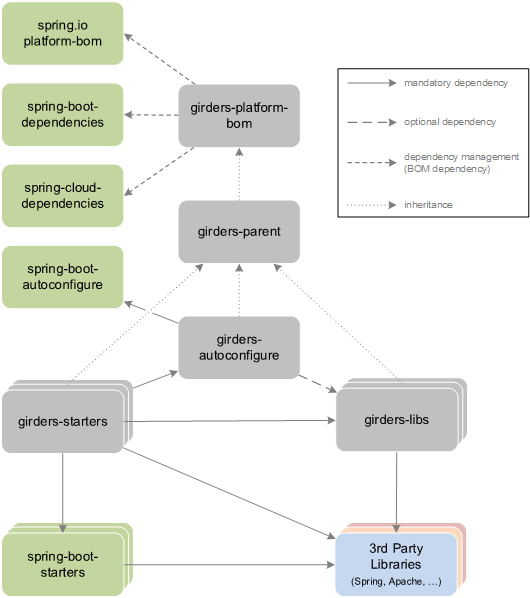

# Girders 4

## Modules

The following gives an overview of the main modules (or groups of modules) provided by Girders:

### girders-platform-bom

Provides a curated list of Maven dependencies for all libraries used by Girders/Spring Boot. Most of the dependencies
are imported from the `io.spring.platform:platform-bom`, `org.springframework.boot:spring-boot-dependencies` and
`org.springframework.cloud:spring-cloud-dependencies` modules, while Girders extends that list with a few additional
dependencies. Applications using Girders do not need to provide a version for any of these dependencies in their build
configuration as Girders is managing those versions. When upgrading Girders itself, these dependencies will be upgraded
as well in a consistent way. Plugin versions (but not configuration) are managed here if they are not solely used for
the Girders build itself.

### girders-parent

`girders-autoconfigure`, `girders-libs` and `girders-starters` inherit from girders-parent. Plugins which are only used
for the Girders build are managed and configured here.

### girders-autoconfigure

Girders extends the auto configuration capabilities provided by Spring Boot. This single module contains the code for
__all__ the auto configuration functionality provided by Girders. This module should contain __optional__ dependencies
to all libraries which are required for any of the features provided by Girders.

### girders-starters

Starter modules are a set of convenient dependency descriptors that can be included in an application to enable a
specific feature of Girders. Starter modules should not contain any code, but rather, they should depend on Girders
library modules or other third party libraries. Starter modules should always depend on the `girders-autoconfigure`
module.

### girders-libs

Library modules contain the code for implementing the actual logic of the features provided by Girders. Library modules
are introduced for consistency with Spring Boot dependencies to avoid having to include any code in the starter modules.
Library modules rely on the dependency management provided by Girders/Spring Boot (by inheriting from
`girders-platform-bom`) but they should not depend on starter modules (neither from Girders nor from Spring Boot)
to make library modules usable independently from the extra functionality by starter modules and the auto
configuration module.

## Module Dependencies

The following diagram illustrates the dependency relationships between different types of modules for Girders and
Spring Boot (the latter for a better understanding):

## Demo Application

Girders comes with a demo application which showcases the main features provided by Girders. The demo application is
packaged as an executable WAR with an embedded Tomcat server, which means that the resulting WAR can be executed
in a standalone mode using `java -jar girders-demo-showcase.war` or deployed to a Java EE servlet container.

### Standalone

To run the demo application in standalone mode in IntelliJ IDEA, do the following:

1. Run a Maven build for Girders (`Build Simple`).
1. Execute one of the `Showcase` runners to run the app.
1. Open the application in your browser: <http://localhost:8080/demo-showcase/>

### Apache Tomcat

To deploy the demo application to a Tomcat Application Server in IntelliJ IDEA, do the following:

1. Configure a new Tomcat server in IntelliJ with the alias `tomcat-girders` (Apache Tomcat 8.5 or later).
1. Run a Maven build for Girders (`Build Simple`).
1. Execute the Tomcat run configuration `girders-demos`.
1. Open the application in your browser: <http://localhost:8080/demo-showcase/>

Note that the Tomcat run configuration `girders-demos` contains a VM parameter with a master password for the encrypted
configuration properties (`-Djasypt.encryptor.password=girders`).

## Releases
SNAPSHOTS:
https://oss.sonatype.org/content/repositories/snapshots/

